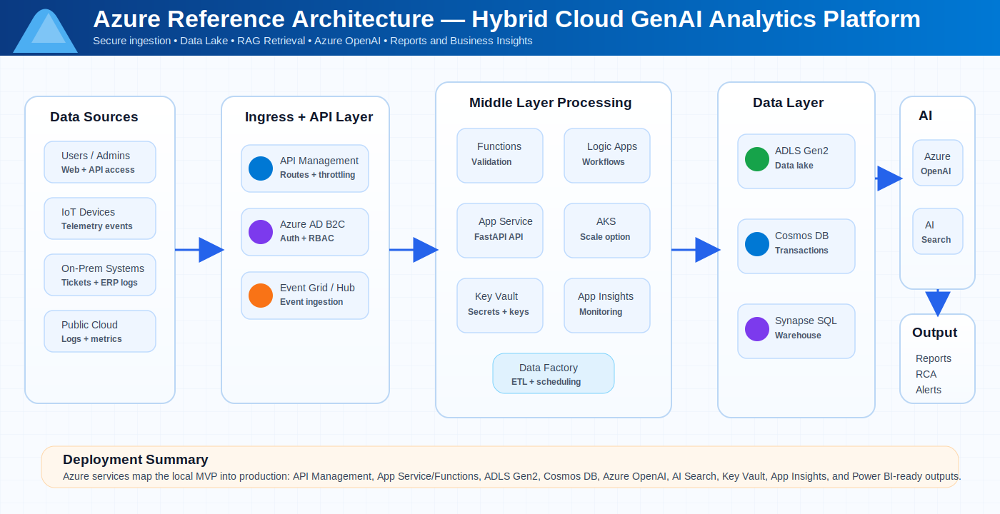
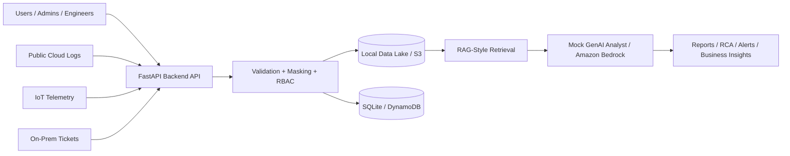

# Hybrid Cloud GenAI Analytics Platform


**Hybrid Cloud GenAI analytics platform for cloud logs, IoT telemetry, on-prem events, RAG-based root cause analysis, secure data lake ingestion, and business intelligence reporting.**

**Local MVP:** FastAPI + SQLite + JSONL Data Lake + Mock GenAI.  
**Cloud Target:** AWS / Azure deployment using managed AI, storage, API, monitoring, and security services.

---

## Azure Reference Architecture

<p align="center">
  
</p>

---

## What This Project Solves

Modern enterprises have scattered data across cloud logs, IoT telemetry, on-prem tickets, business events, and user requests. This platform brings that data into one controlled middle layer, stores it in a data lake, retrieves relevant context, and generates business-ready AI outputs such as:

- root cause analysis
- incident summaries
- operational recommendations
- data quality insights
- business reports
- dashboard-ready metrics

---

## Architecture



---

## Key Features

| Area | Implementation |
|---|---|
| Backend API | FastAPI with typed request/response models |
| Data Ingestion | Cloud logs, IoT telemetry, on-prem tickets, business events |
| Data Lake | Local file-based JSONL data lake simulation |
| Transaction DB | SQLite for AI request history and audit records |
| AI Layer | Mock GenAI analyst with optional Amazon Bedrock service layer |
| RAG Flow | Keyword-based local retrieval for recruiter demo |
| Security | API key check, role-based access, PII masking, audit logging |
| Frontend | Static HTML/CSS/JS demo dashboard |
| DevOps | Docker, Docker Compose, GitHub Actions CI |
| Infrastructure | AWS SAM and Terraform starter templates |
| Documentation | API guide, architecture guide, GUI demo script, interview Q&A |

---

## Repository Structure

```text
Hybrid-Cloud-GenAI-Analytics-Platform/
├── .github/workflows/ci.yml
├── backend/
│   ├── app/
│   │   ├── main.py
│   │   ├── config.py
│   │   ├── database.py
│   │   ├── models.py
│   │   ├── security.py
│   │   ├── lambda_handler.py
│   │   ├── services/
│   │   └── utils/
│   ├── tests/
│   ├── requirements.txt
│   └── Dockerfile
├── data/sample/
├── docs/
│   ├── images/
│   │   └── azure-reference-architecture.svg
│   ├── api.md
│   ├── architecture.md
│   ├── gui-demo-script.md
│   ├── interview-qna.md
│   └── roadmap.md
├── frontend/
│   ├── index.html
│   ├── styles.css
│   └── app.js
├── infrastructure/
│   ├── aws-sam/template.yaml
│   └── terraform/
├── postman/
├── scripts/
├── docker-compose.yml
└── README.md
```

---

## Quick Start: Local Demo

### 1. Clone the repository

```bash
git clone https://github.com/ghostironvault23-alphawork/Hybrid-Cloud-GenAI-Analytics-Platform.git
cd Hybrid-Cloud-GenAI-Analytics-Platform
```

### 2. Create and activate Python environment

```bash
cd backend
python -m venv .venv

# Windows
.venv\Scripts\activate

# macOS/Linux
source .venv/bin/activate
```

### 3. Install dependencies

```bash
pip install -r requirements.txt
```

### 4. Start the backend

```bash
uvicorn app.main:app --reload --port 8000
```

Open API docs:

```text
http://localhost:8000/docs
```

### 5. Seed sample enterprise data

Open a second terminal from the project root:

```bash
python scripts/seed_data.py
```

### 6. Test the AI workflow

```bash
curl -X POST http://localhost:8000/ask-ai \
  -H "Content-Type: application/json" \
  -d "{\"question\":\"Why did payment service fail?\",\"user_id\":\"demo-user\",\"role\":\"Engineer\"}"
```

### 7. Open frontend demo

Open this file in your browser:

```text
frontend/index.html
```

Try these demo questions:

```text
Why did payment service fail?
Show IoT anomalies
Summarize cloud cost issues
What are the latest critical events?
```

---

## Docker Demo

```bash
docker compose up --build
```

Backend:

```text
http://localhost:8000
```

API docs:

```text
http://localhost:8000/docs
```

---

## API Endpoints

| Method | Endpoint | Purpose |
|---|---|---|
| GET | `/health` | Check backend status |
| POST | `/ingest/event` | Ingest one enterprise event |
| POST | `/ingest/batch` | Ingest multiple events |
| POST | `/ask-ai` | Ask AI analyst a question |
| GET | `/reports/summary` | Get platform summary report |
| GET | `/events/search` | Search data lake events |

---

## Local MVP to Cloud Mapping

| Local MVP Component | AWS Equivalent | Azure Equivalent |
|---|---|---|
| Static frontend | S3 + CloudFront / Amplify | Static Web Apps |
| FastAPI backend | Lambda / ECS / EKS | App Service / Functions |
| Local data lake | Amazon S3 | Azure Data Lake Storage Gen2 |
| SQLite transactions | DynamoDB / RDS | Cosmos DB / Azure SQL |
| Mock AI analyst | Amazon Bedrock | Azure OpenAI |
| Local retrieval | Bedrock Knowledge Base / OpenSearch | Azure AI Search |
| Local logs | CloudWatch | Application Insights |
| API routes | API Gateway | API Management |
| API key demo auth | Cognito + JWT | Azure AD B2C / Entra ID |
| Scripts | Glue / Step Functions | Data Factory / Logic Apps |

---

## Recruiter Pitch

> I built a hybrid cloud GenAI analytics platform that ingests data from public cloud logs, IoT telemetry, and on-prem systems. The middle layer validates, masks, and stores data into a data lake and transaction database. A RAG-style retrieval layer finds relevant enterprise context, and the AI layer generates root cause analysis, summaries, reports, and recommendations. The MVP runs locally using FastAPI, SQLite, and a mock GenAI service, and it is designed to scale on AWS or Azure using managed cloud services.

---

## Validation

Run syntax checks and tests:

```bash
cd backend
python -m compileall app
pytest
```

Expected result:

```text
2 passed
```

---

## Documentation

| Document | Purpose |
|---|---|
| `docs/architecture.md` | End-to-end architecture explanation |
| `docs/api.md` | API endpoint guide |
| `docs/gui-demo-script.md` | Recruiter demo explanation script |
| `docs/interview-qna.md` | Interview questions and concise answers |
| `docs/roadmap.md` | Project improvement roadmap |
| `VALIDATION.md` | Local validation checklist |
| `SECURITY.md` | Security design notes |

---

## Future Improvements

- Add Cognito / Azure AD B2C authentication
- Add Amazon Bedrock or Azure OpenAI live integration
- Add vector search with OpenSearch or Azure AI Search
- Add dashboards with QuickSight or Power BI
- Add real IoT Core / Azure IoT Hub ingestion
- Add CI/CD deployment to cloud
- Add PII detection and guardrails
- Add multi-cloud data connectors

---

## License

MIT License
